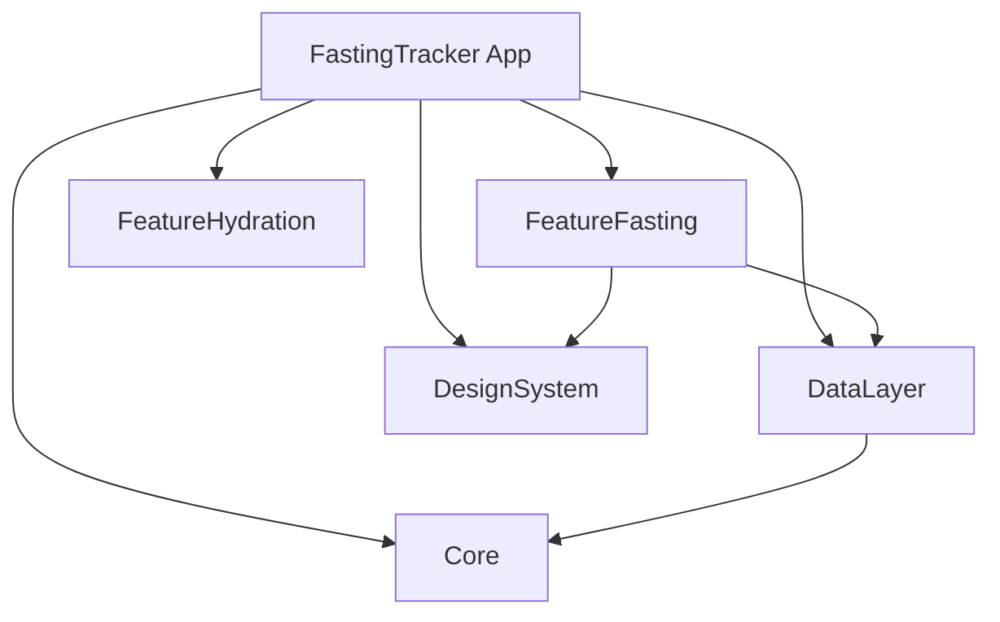

# 🤖 Automation Guide: Save 60+ Hours

**Automate ~17% of the 350-hour transformation with scripts.**

**Related Documents:**
- [Phase 0: Foundation](./PHASE_0_FOUNDATION.md) - Uses automation in Weeks 1-2
- [Phase 1: Architecture](./PHASE_1_ARCHITECTURE.md) - Uses automation in Week 4
- [Phase 2: Scale & Polish](./PHASE_2_SCALE_POLISH.md) - Uses automation in Week 9
- [Roadmap & Timeline](./ROADMAP_TIMELINE.md) - Time savings reflected here

---

## 📊 Time Savings Summary

| Category | Manual Time | Automated Time | Savings |
|----------|-------------|----------------|---------|
| **Code Migration** | 20h | 30 min | 19.5h |
| **CI/CD Operations** | 10h/week | 2h/week | 8h/week |
| **Code Quality** | 10h/week | 1h/week | 9h/week |
| **Documentation** | 5h | 15 min | 4.75h |
| **TOTAL** | ~90h+ | ~30h | **~60h saved** |

**ROI:** 15 minutes to set up automation saves 60+ hours over 16 weeks

---

## 🎯 Quick Start (15 minutes)

```bash
cd /Users/richmarin/fast-life

# 1. Scripts already created in ../scripts/
# 2. Run master setup
chmod +x scripts/setup_all.sh
./scripts/setup_all.sh

# 3. Test automation
fl-lint      # Run SwiftLint
fl-format    # Format code
fl-test      # Run tests
fl-coverage  # Coverage report
```

---

## 📋 All Available Scripts

### **Setup & Configuration**
1. **`setup_all.sh`** - Master setup (installs everything)
2. **`setup_git_hooks.sh`** - Pre-commit automation

### **Code Migration**
3. **`migrate_to_logger.sh`** - Replace print() with AppLogger
4. **`add_accessibility_labels.py`** - Find missing accessibility labels
5. **`generate_swiftdata_models.sh`** - Convert Codable to SwiftData
6. **`find_force_unwraps.sh`** - Detect unsafe force unwraps

### **CI/CD & Testing**
7. **`coverage_report.sh`** - Generate coverage reports
8. **`deploy_testflight.sh`** - Automated TestFlight deployment

### **Code Quality**
9. **`format_on_save.sh`** - Auto-format on file save

### **Documentation**
10. **`generate_docs.sh`** - Generate API documentation
11. **`generate_architecture_diagram.py`** - Create architecture diagrams

---

## 🚀 HIGH-VALUE AUTOMATIONS

### 1. Replace print() with AppLogger (Save 4 hours)

**Manual:** Find 19+ print() statements and replace carefully
**Automated:** Run script, review changes, done

**Script:** [`scripts/migrate_to_logger.sh`](../scripts/migrate_to_logger.sh)

**Usage:**
```bash
./scripts/migrate_to_logger.sh
# Review changes
git diff
# If satisfied, delete .backup files
find . -name "*.backup" -delete
```

**What it does:**
- Finds all `print()` statements
- Replaces with appropriate `AppLogger` calls
- Backs up originals (.backup files)
- Categorizes by context (error, warning, info, debug)

**Time savings:** 4h → 5 min

---

### 2. Find Missing Accessibility Labels (Save 8 hours)

**Manual:** Open every view, check every element, add labels
**Automated:** Scan all files, report issues, suggest fixes

**Script:** [`scripts/add_accessibility_labels.py`](../scripts/add_accessibility_labels.py)

**Usage:**
```bash
./scripts/add_accessibility_labels.py
```

**Output:**
```
📄 ContentView.swift:
  Line 42: Image(systemName: "flame.fill") → Add .accessibilityLabel("flame")
  Line 108: Image(systemName: "drop.fill") → Add .accessibilityLabel("drop")

📄 HistoryView.swift:
  Line 23: Image(systemName: "calendar") → Add .accessibilityLabel("calendar")

📊 Summary: Found issues in 12/18 files
```

**Time savings:** 8h → 15 min + manual review

---

### 3. Generate SwiftData Models (Save 4 hours)

**Manual:** Convert each Codable struct to @Model class by hand
**Automated:** Script converts structure, you add relationships

**Script:** [`scripts/generate_swiftdata_models.sh`](../scripts/generate_swiftdata_models.sh)

**Usage:**
```bash
./scripts/generate_swiftdata_models.sh FastingTracker/FastingSession.swift
# Creates: FastingTracker/FastingSession_SwiftData.swift
```

**What it does:**
- Changes `struct` → `final class`
- Removes `Codable`
- Adds `@Model` annotation
- Adds imports

**You still need to:**
- Add `@Relationship` for relationships
- Add `@Transient` for computed properties
- Test thoroughly

**Time savings:** 4h → 10 min per model

---

### 4. Find Force Unwraps (Save 2 hours)

**Manual:** Read every line looking for `!`, `as!`, `try!`
**Automated:** Script finds all instances with context

**Script:** [`scripts/find_force_unwraps.sh`](../scripts/find_force_unwraps.sh)

**Usage:**
```bash
./scripts/find_force_unwraps.sh
```

**Output:**
```
=== FORCE UNWRAPS (!) ===
FastingManager.swift:45: let session = sessions.first!
FastingManager.swift:102: return date!

=== FORCE CASTS (as!) ===
HealthKitManager.swift:78: let sample = samples.first as! HKQuantitySample

📊 Summary:
Force unwraps: 23
Force casts: 5
Force try: 2
```

**Time savings:** 2h → 2 min detection (still need manual fixes)

---

### 5. Pre-Commit Hooks (Save 2h/week)

**Manual:** Remember to run SwiftLint and tests before commit
**Automated:** Runs automatically, blocks bad commits

**Script:** [`scripts/setup_git_hooks.sh`](../scripts/setup_git_hooks.sh)

**Usage:**
```bash
./scripts/setup_git_hooks.sh
# Now every 'git commit' runs checks automatically
```

**What it does:**
- Runs SwiftLint before every commit
- Runs critical tests before every commit
- Blocks commit if checks fail
- Saves you from pushing broken code

**Time savings:** 10 min/commit × 20 commits/week = 2h/week

---

### 6. TestFlight Deployment (Save 2h/release)

**Manual:** Archive, export, upload via Xcode Organizer
**Automated:** One command deploys to TestFlight

**Script:** [`scripts/deploy_testflight.sh`](../scripts/deploy_testflight.sh)

**Setup:**
```bash
# 1. Set environment variables
export APPLE_ID="your@email.com"
export APP_SPECIFIC_PASSWORD="xxxx-xxxx-xxxx-xxxx"

# 2. Create ExportOptions.plist (one-time)
cat > ExportOptions.plist << EOF
<?xml version="1.0" encoding="UTF-8"?>
<!DOCTYPE plist PUBLIC "-//Apple//DTD PLIST 1.0//EN" "http://www.apple.com/DTDs/PropertyList-1.0.dtd">
<plist version="1.0">
<dict>
    <key>method</key>
    <string>app-store</string>
    <key>uploadSymbols</key>
    <true/>
    <key>uploadBitcode</key>
    <false/>
</dict>
</plist>
EOF
```

**Usage:**
```bash
./scripts/deploy_testflight.sh
# Wait 10-15 minutes
# Check App Store Connect
```

**Time savings:** 2h → 30 min per release

---

### 7. Auto-Format on Save (Save 3h/week)

**Manual:** Run SwiftFormat manually, or format inconsistently
**Automated:** Every save triggers formatting in background

**Script:** [`scripts/format_on_save.sh`](../scripts/format_on_save.sh)

**Usage:**
```bash
# Start in background
./scripts/format_on_save.sh &

# Or add to your shell startup
echo './scripts/format_on_save.sh &' >> ~/.zshrc
```

**What it does:**
- Watches all .swift files
- Runs SwiftFormat on any change
- Keeps code consistently formatted
- Never think about formatting again

**Time savings:** 30 min/day × 6 days = 3h/week

---

### 8. Coverage Report (Save 1h/week)

**Manual:** Run tests, open Xcode Organizer, export report, analyze
**Automated:** One command generates beautiful HTML report

**Script:** [`scripts/coverage_report.sh`](../scripts/coverage_report.sh)

**Usage:**
```bash
./scripts/coverage_report.sh
# Opens HTML report in browser
```

**What it does:**
- Runs tests with coverage enabled
- Generates JSON + HTML reports
- Opens in browser automatically
- Shows coverage % per file
- Highlights untested code
- Fails if below 70% threshold

**Time savings:** 1h → 5 min per report

---

### 9. Generate API Documentation (Save 2 hours)

**Manual:** Write docs by hand, keep in sync with code
**Automated:** Generate from code comments

**Script:** [`scripts/generate_docs.sh`](../scripts/generate_docs.sh)

**Usage:**
```bash
./scripts/generate_docs.sh
# Opens docs/api/index.html
```

**Requirements:**
Add doc comments to your code:
```swift
/// Manager responsible for fasting session lifecycle
///
/// Handles creating, ending, and persisting fasting sessions.
/// Calculates streaks based on consecutive daily fasts.
///
/// - Note: Enforces one fast per day rule
/// - Warning: Must call `startFast()` before `endFast()`
public class FastingManager {

    /// Start a new fasting session
    ///
    /// - Parameter goalHours: Optional goal in hours (e.g., 16.0)
    /// - Returns: The newly created session
    /// - Throws: `FastingError` if session already active
    public func startFast(goalHours: Double? = nil) throws -> FastingSession {
        // ...
    }
}
```

**Time savings:** 2h → 5 min (after adding doc comments)

---

### 10. Architecture Diagrams (Save 3 hours)

**Manual:** Draw diagrams in tool, update when structure changes
**Automated:** Generate from code structure

**Script:** [`scripts/generate_architecture_diagram.py`](../scripts/generate_architecture_diagram.py)

**Usage:**
```bash
./scripts/generate_architecture_diagram.py
```

**Output:**


**Copy to README.md** and GitHub renders it automatically

**Time savings:** 3h → 2 min

---

## 🔄 COMPLETE AUTOMATION SETUP

### Master Setup Script

**Script:** [`scripts/setup_all.sh`](../scripts/setup_all.sh)

**What it does:**
1. Installs SwiftLint, SwiftFormat, fswatch
2. Sets up Git pre-commit hooks
3. Creates useful shell aliases
4. Configures auto-formatting
5. Tests all automation

**Usage:**
```bash
chmod +x scripts/setup_all.sh
./scripts/setup_all.sh
```

**New commands available:**
```bash
fl-test       # Run all tests
fl-build      # Build project
fl-lint       # Run SwiftLint
fl-format     # Format all code
fl-coverage   # Generate coverage report
fl-deploy     # Deploy to TestFlight
```

---

## 📊 AUTOMATION BY PHASE

### Phase 0 (Week 1): Setup Automation
```bash
# Day 1: Set up automation infrastructure
./scripts/setup_all.sh                    # 15 min
./scripts/setup_git_hooks.sh              # 5 min

# Day 4: Migrate logging
./scripts/migrate_to_logger.sh            # 5 min (saves 4h)

# Ongoing: Auto-format
./scripts/format_on_save.sh &             # Background (saves 3h/week)
```

**Time saved in Week 1:** 4 hours

---

### Phase 0 (Week 2): Security & Testing
```bash
# Find unsafe code
./scripts/find_force_unwraps.sh           # 2 min

# Track test coverage
./scripts/coverage_report.sh              # 5 min (saves 1h/week)
```

**Time saved in Week 2:** 2 hours

---

### Phase 1 (Week 4): Migration
```bash
# Convert models to SwiftData
./scripts/generate_swiftdata_models.sh FastingTracker/FastingSession.swift
./scripts/generate_swiftdata_models.sh FastingTracker/WeightEntry.swift
./scripts/generate_swiftdata_models.sh FastingTracker/HydrationEntry.swift

# Generate architecture diagram
./scripts/generate_architecture_diagram.py
```

**Time saved in Week 4:** 4 hours

---

### Phase 2 (Week 9): Accessibility
```bash
# Find missing labels
./scripts/add_accessibility_labels.py     # 15 min (saves 8h)
```

**Time saved in Week 9:** 8 hours

---

### Phase 2 (Week 12): Launch
```bash
# Generate documentation
./scripts/generate_docs.sh                # 5 min (saves 2h)

# Deploy to TestFlight
./scripts/deploy_testflight.sh           # 30 min (saves 2h)
```

**Time saved in Week 12:** 4 hours

---

## 🎯 TASKS THAT CAN'T BE AUTOMATED

**High-judgment tasks (must do manually):**
- ❌ Writing meaningful test assertions
- ❌ Designing architecture
- ❌ Choosing accessibility labels (script finds, you decide)
- ❌ Refactoring complex logic
- ❌ Security threat modeling
- ❌ Performance optimization decisions
- ❌ User research & testing

**One-time setup (templates provided, but you customize):**
- ⚠️ Privacy manifest (2h, use template from Phase 0)
- ⚠️ Firebase setup (1h, web UI)
- ⚠️ GitHub Actions (4h, use template from Phase 0)
- ⚠️ KeychainManager (6h, use code from Phase 0)

---

## 💡 BEST PRACTICES

### When to Use Automation
✅ **Use automation for:**
- Repetitive code changes (print → logger)
- Code scanning (force unwraps, missing labels)
- Report generation (coverage, docs)
- Formatting (SwiftFormat)
- Testing (pre-commit hooks)
- Deployment (TestFlight)

❌ **Don't automate:**
- First-time learning (understand before automating)
- Complex decisions (architecture, security)
- Creative work (UX design, naming)
- Human judgment (accessibility labels)

### Automation Workflow
1. **Learn manually first** - Understand the task
2. **Automate repetition** - Use scripts for 2nd+ time
3. **Validate output** - Always review automated changes
4. **Iterate** - Improve scripts over time

---

## 🔧 TROUBLESHOOTING

### Common Issues

**"Command not found: swiftlint"**
```bash
brew install swiftlint
```

**"Permission denied"**
```bash
chmod +x scripts/*.sh
```

**"Python script won't run"**
```bash
chmod +x scripts/*.py
# If Python 3 not found:
brew install python3
```

**"Pre-commit hook not running"**
```bash
# Check if installed
ls -la .git/hooks/pre-commit

# Reinstall
./scripts/setup_git_hooks.sh
```

**"fswatch not found" (format_on_save.sh)**
```bash
brew install fswatch
```

**"jazzy not found" (generate_docs.sh)**
```bash
gem install jazzy
# Or use sudo if needed:
sudo gem install jazzy
```

---

## 📈 MEASURING AUTOMATION ROI

**Track time savings:**
```bash
# Create time tracking file
cat > automation_time_log.md << EOF
# Automation Time Savings Log

## Week 1
- Migrated print() statements: 5 min (saved 4h)
- Set up pre-commit hooks: 10 min (saves 2h/week)
- Auto-format setup: 5 min (saves 3h/week)
**Total saved this week: 4h**

## Week 2
- Force unwrap scanning: 2 min (saved 2h)
- Coverage reports: 5 min (saved 1h)
**Total saved this week: 3h**

## Running Total: 7 hours saved
EOF
```

**Update weekly** to see ROI

---

## 🎉 SUCCESS METRICS

**You're using automation effectively when:**
- ✅ Commits are automatically checked (pre-commit hooks)
- ✅ Code is always formatted (format-on-save running)
- ✅ Coverage reports generated weekly
- ✅ No manual print() replacements needed
- ✅ TestFlight deployments take <30 min
- ✅ You use shell aliases (fl-test, fl-lint, etc.)

**Warning signs (not automating enough):**
- ❌ Manually running SwiftLint before commits
- ❌ Inconsistent code formatting
- ❌ Spending >1h on repetitive tasks
- ❌ Deploying to TestFlight takes >2h
- ❌ Not running tests frequently

---

## 📚 Next Steps

1. **[ ] Run master setup** - `./scripts/setup_all.sh`
2. **[ ] Test aliases** - Run `fl-lint`, `fl-test`, `fl-format`
3. **[ ] Set up auto-format** - `./scripts/format_on_save.sh &`
4. **[ ] Integrate into workflow** - Use scripts during phases

**Related Documents:**
- [Phase 0: Foundation](./PHASE_0_FOUNDATION.md) - Use automation from Day 1
- [Phase 1: Architecture](./PHASE_1_ARCHITECTURE.md) - Use model generation
- [Phase 2: Scale & Polish](./PHASE_2_SCALE_POLISH.md) - Use accessibility scanning
- [Roadmap & Timeline](./ROADMAP_TIMELINE.md) - Time savings reflected here

---

**🤖 Automation is a force multiplier. 15 minutes of setup saves 60+ hours of work. Set it up now.** 🚀

---

**[⬅️ Back to Master Plan](../ENTERPRISE_TRANSFORMATION_MASTER.md)** | **[📖 View All Scripts](../scripts/)**
